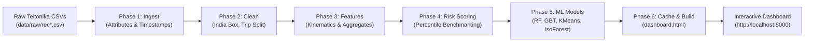

# Vehicle Analytics & Driver Behaviour Management System

**Researcher:** Ujjwal Tyagi | **Supervisor:** Mayank Kumar (BOSCH)  

---

## 📌 Project Overview

A production-grade fleet intelligence and telematics machine learning system that ingests raw **Teltonika GPS telematics data** and provides:
- **End-to-End ML Pipeline**: Supervised Risk Classification, Unsupervised Driver Clustering, Isolation Forest Anomaly Detection, and Permutation Feature Importance.
- **Dynamic Ingestion**: Auto-detects additions or deletions of vehicle CSV files in `data/raw/` and recalculates all metrics automatically.
- **Interactive Dark-Theme Dashboard**: Single-page glassmorphic interface with 8 analytical modules powered by Chart.js, Leaflet.js, and OSRM road routing.
- **Kinematic & Risk Intelligence**: Derives physical acceleration ($m/s^2$), angular velocity ($deg/s$), peer-benchmarked composite risk scores (0–100), and driver consistency ratings.

**Fleet Coverage:** Multi-city commercial fleet across **Bengaluru, Hyderabad, Delhi NCR, and Mumbai**  
**Telematics Volume:** 360,000+ GPS/sensor records | 6,400+ trips | May 2021  

---

## 🚀 Quick Start

### 1. First-Time Setup

**Windows:**
```cmd
setup.bat
```

**Mac / Linux:**
```bash
chmod +x setup.sh run.sh
./setup.sh
```

---

### 2. Launch Dashboard

**Windows:**
```cmd
run.bat
```
*(or run `python run_pipeline.py` followed by `python api/server.py`)*

**Mac / Linux:**
```bash
./run.sh
```

The dashboard opens automatically in your browser at:  
👉 **`http://localhost:8000`** *(or open `frontend/dashboard.html` directly)*

---

## 📂 Project Structure

```text
vehicle-analytics/
├── setup.bat / setup.sh         # First-time environment setup
├── run.bat / run.sh             # Validates cache, runs pipeline if needed, starts server
├── check_cache.py               # Cache signature and data integrity validator
├── run_pipeline.py              # Master pipeline runner
├── requirements.txt             # Python dependencies
│
├── data/
│   └── raw/                     # Place raw Teltonika rec*.csv files here
│
├── pipeline/
│   ├── ingest.py                # Phase 1: CSV loader, timestamp & attribute parser
│   ├── clean.py                 # Phase 2: GPS filtering, speed sanity & trip segmentation
│   ├── features.py              # Phase 3: Kinematic & angular feature engineering
│   ├── labels.py                # Phase 4: Weak labeling & composite driver risk scoring
│   ├── models.py                # Phase 5: Supervised, KMeans, IsolationForest, Explainability
│   └── build_dashboard.py       # Phase 6: HTML injector & dashboard compiler
│
├── cache/                       # Auto-generated analytical JSON payloads
│   ├── fleet_summary.json
│   ├── vehicle_leaderboard.json
│   ├── trips_slim.json
│   ├── gps_slim.json
│   ├── ml_results.json
│   ├── cluster_scatter.json
│   └── anomaly_insights.json
│
├── api/
│   └── server.py                # Lightweight HTTP server + GPS trip replay endpoint
│
└── frontend/
    ├── dashboard_template.html  # Clean master HTML template
    └── dashboard.html           # Live, compiled dashboard with embedded data
```

---

## 🔄 End-to-End Pipeline Phases



1. **Ingest ([`pipeline/ingest.py`](file:///c:/Users/muska/Desktop/vehicle-analytics/vehicle-analytics/pipeline/ingest.py))**:
   - Ingests all `rec*.csv` files and assigns vehicle identifiers.
   - Deserializes nested JSON/string dictionaries within the `attributes` field (extracting ADC, battery, satellite count, accelerometer axes, alarms).
   - Normalizes timestamps to UTC and standardizes boolean flags (`ignition`, `motion`, `valid`).

2. **Clean & Segment ([`pipeline/clean.py`](file:///c:/Users/muska/Desktop/vehicle-analytics/vehicle-analytics/pipeline/clean.py))**:
   - **GPS Filtering**: Bounded to India geographic coordinates ($8^\circ \le \text{Lat} \le 37^\circ, 68^\circ \le \text{Lon} \le 97^\circ$) with satellite count $\ge 3$.
   - **Speed Sanity**: Hard cap at $150\text{ km/h}$; zeroes GPS drift ($>5\text{ km/h}$ when ignition is OFF).
   - **Trip Segmentation**: Detects trip boundaries when ignition transitions `OFF` $\to$ `ON` or time gap between pings exceeds $300\text{ seconds (5 min)}$. Discards micro-trips ($<10$ points).

3. **Feature Engineering ([`pipeline/features.py`](file:///c:/Users/muska/Desktop/vehicle-analytics/vehicle-analytics/pipeline/features.py))**:
   - **Acceleration**: $a = \frac{\Delta v}{\Delta t}$ in $\text{m/s}^2$ (capped to $\pm 5\text{ m/s}^2$).
   - **Course Angular Velocity**: $\text{deg/s}$ calculated with $0^\circ \leftrightarrow 360^\circ$ wrap-around correction.
   - **Event Triggers**: Overspeed ($>40\text{ km/h}$), Harsh Acceleration ($>0.4\text{ m/s}^2$), Harsh Braking ($<-0.4\text{ m/s}^2$), Sharp Turn ($>30^\circ/\text{s}$), and Idling.
   - **Trip Feature Matrix**: Aggregates 33 statistical & kinematic features per trip for ML input.

4. **Weak Labeling & Composite Risk Scoring ([`pipeline/labels.py`](file:///c:/Users/muska/Desktop/vehicle-analytics/vehicle-analytics/pipeline/labels.py))**:
   - **Weak Labels**: Categorizes trips into **Low (0)**, **Medium (1)**, or **High (2)** risk using rule-based event thresholds.
   - **Composite Driver Risk Score (0–100 scale)**:
     $$\text{Risk Score} = 0.25 \cdot \text{Overspeed} + 0.25 \cdot \text{Harsh Brake} + 0.20 \cdot \text{Harsh Accel} + 0.15 \cdot \text{Sharp Turn} + 0.15 \cdot \text{Speed}_{p95}$$
   - **Peer Benchmarking**: Features are normalized using **fleet-relative percentile ranking** ($\text{rank}_{\text{pct}}$).
   - **Risk Consistency ($\sigma$)**: Computes standard deviation of trip risk per vehicle to identify erratic driving patterns.

5. **Machine Learning Models ([`pipeline/models.py`](file:///c:/Users/muska/Desktop/vehicle-analytics/vehicle-analytics/pipeline/models.py))**:
   - **Supervised Classification**: Random Forest & Gradient Boosting with balanced class weights (**ROC-AUC: 0.999–1.000**).
   - **Driver Profiling**: KMeans clustering with silhouette score optimization ($k=2,3,4$) and PCA 2D embedding (**Safe / Moderate / Aggressive**).
   - **Anomaly Detection**: Isolation Forest (5% contamination rate) flags outlier trips with explainable root causes (*Night Operation*, *Extreme Risk*, *Unusually Long Duration*, *Above-Fleet Speed*).
   - **Model Explainability**: Permutation feature importance rankings identifying top kinematic drivers.

---

## 📊 Dashboard Modules

| Module | Features & Capabilities |
| :--- | :--- |
| **Fleet Command Centre** | Real-time fleet KPIs, device alarms (power cuts, tows, harsh braking), composite risk histogram, driver profile doughnut, and regional breakdown. |
| **Driver Leaderboard** | Filterable & sortable table ranking all fleet vehicles by Risk Score, Fleet Percentile, Total Trips, Harsh Brakes, and Inconsistency ($\sigma$). |
| **Trip Analyser** | Vehicle selector with route playback snapped to real-world road networks (via OSRM), trip speed profile charts, and chronological event logs. |
| **Anomaly Centre** | Outlier trip explorer categorized by anomaly root cause, hour-of-day distribution, and per-vehicle anomaly counts. |
| **Behaviour Analytics** | Hour $\times$ Day heatmaps for harsh braking and acceleration, PCA cluster scatter plot, day-of-week risk curves, and vehicle-vs-vehicle comparisons. |
| **ML Intelligence** | Model performance comparisons (Random Forest vs Gradient Boosting), multi-class ROC curves, confusion matrices, and permutation feature importance charts. |
| **AI Insights** | Deep dive into operational risk: shift-change peak risk hours (03:00–07:00), trip duration vs risk correlation (driver fatigue), and consistency distribution. |
| **Fleet Risk Map** | Interactive Leaflet map with layer toggles (Heatmap, Hard Braking, Harsh Accel, Overspeed, Sharp Turn, Alarms) and city/vehicle filters. |

---

## 🛠️ Technical Stack

| Layer | Technologies Used |
| :--- | :--- |
| **Data Processing** | Python 3.10+, `pandas`, `numpy`, `scipy` |
| **Machine Learning** | `scikit-learn` (Random Forest, Gradient Boosting, KMeans, Isolation Forest, PCA) |
| **Backend / Web Server** | Python standard library `http.server` (Zero external web framework overhead) |
| **Dashboard UI** | HTML5, Modern CSS (Glassmorphic dark design), Vanilla JavaScript |
| **Visualizations** | `Chart.js 4.4` (CDN) |
| **Mapping & Routing** | `Leaflet.js 1.9`, `leaflet-heat`, OSRM Road Routing API |
| **Data Storage** | JSON cache with embedded template compiler |

---

## 🔄 Adding or Modifying Telematics Data

The system is fully dynamic:
1. Place any new `rec*.csv` files into [`data/raw/`](file:///c:/Users/muska/Desktop/vehicle-analytics/vehicle-analytics/data/raw/) (or delete unwanted files).
2. Launch [`run.bat`](file:///c:/Users/muska/Desktop/vehicle-analytics/vehicle-analytics/run.bat) (or run `python run_pipeline.py`).
3. The cache validator will automatically detect changes, re-run all 6 pipeline phases, retrain the models, and rebuild `dashboard.html`.
